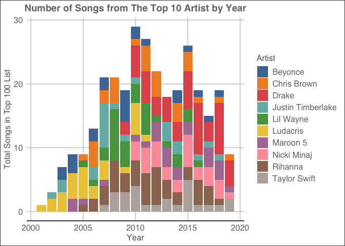
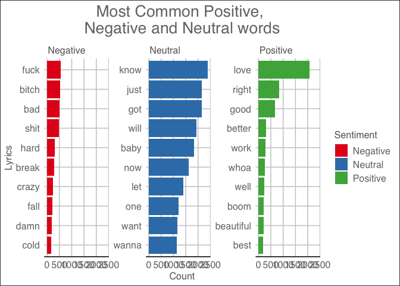
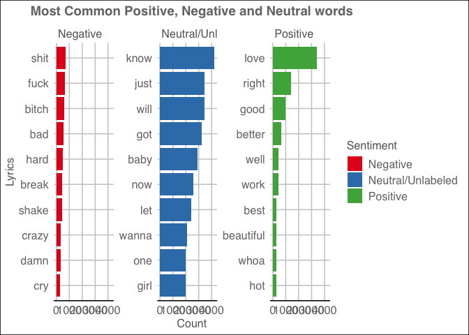
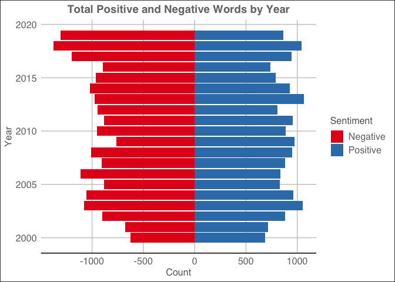

Fun with music: Exploring how words in pop songs have changed over time
================

#### Sources

  - Pop songs and their ranking: Pop songs for each year were gathered
    from Billboard’s top 100 rankings found here:
    <https://www.billboard.com/charts/hot-100> For each song, the date
    when the song peaked and the peak ranking on Billboard was gathered
    from each song’s page, for example:
    <https://www.billboard.com/charts/hot-100?rank=1>

  - Lyrics: All lyrics were gathered from AZLyrics.com

#### Getting the data

The file “01 Scrapping Songs” scrapes Billboard for the top 100 songs in
each year from 2009 to 2019. From Billboard I can get the peak rank for
the song, it’s peak date and highest rank position in the year and
supporting artists. Then, each song + artist combo is searched on
AZLyrics to create the lyrics dataset. Some songs were associated with
the supporting artists on AZLyrics only so I re-ran the script to get
more matches.

**Total songs and artists by year gathered from
Billboard:**

| Year | Total Songs | Distinct Artists | Songs With Lyrics | Songs with Peak Dates |
| :--- | ----------: | ---------------: | ----------------: | --------------------: |
| 2009 |         100 |               88 |                90 |                    95 |
| 2010 |         100 |               91 |                86 |                    88 |
| 2011 |          99 |               99 |                84 |                    85 |
| 2012 |         100 |               84 |                90 |                    90 |
| 2013 |         100 |              104 |                87 |                    85 |
| 2014 |         100 |              109 |                91 |                    92 |
| 2015 |         100 |              101 |                85 |                    93 |
| 2016 |          99 |               90 |                83 |                    93 |
| 2017 |         100 |              105 |                88 |                    91 |
| 2018 |         100 |              100 |                92 |                    81 |
| 2019 |         100 |               94 |                96 |                    73 |

**Notes:**

  - There is an extra song in 2012. This is because Christina Perri’s
    song “A Thousand Years” comes in two parts and is being treated as
    one entry. For now I will keep these songs separate despite having
    the same ranking
  - For some reason 2011 and 2016 have missing songs. In 2011, number 7
    is missing and in 2016, number 87 is missing
  - Peak date information was not available for all songs but ranges
    from 70% to 95% depending on year

#### Looking at top artists over time

The top 10 most popular artists across the data:

| Artist        | Total Top Songs |
| :------------ | --------------: |
| Drake         |              51 |
| Rihanna       |              33 |
| Nicki Minaj   |              29 |
| Taylor Swift  |              22 |
| Lil Wayne     |              19 |
| Maroon 5      |              19 |
| Ariana Grande |              18 |
| Bruno Mars    |              18 |
| Chris Brown   |              18 |
| Justin Bieber |              18 |

Drake is consinderably more popular than the next artist in the list
with over 50 songs making the top 100 list.

How does the success of top artists track over time?

<!-- -->

#### Looking at the lyrics of songs by year

The lyrics data is pretty messy, it has a lot of “words” like “oh oh
oh…”. I have tried to filter these out using stop words from
tidytext as well as other general cleaning (removing punctuation, spaces
etc).

To start, I want to see whether words fall into “positive” or “negative”
categories. I’m using “get\_sentiment” from tidytext and Bing Liu and
Co’s dataset. This dataset classifies words into “positive” or
“negative” categories. How does this change over time?

<!-- -->

I see a lot of words that are marked NA. I’m not sure which ones are NA
because they’re neutral and which ones are NA because they’re not really
words like “oooh”. *Problem* Need to solve for this- maybe I can remove
words that are non-standard?

Taking a look at the most common words and their sentiments:

| Words | Sentiment | Total Instances |
| :---- | :-------- | --------------: |
| you   | NA        |           14882 |
| the   | NA        |           10119 |
| not   | NA        |            6542 |
| and   | NA        |            5889 |
| that  | NA        |            4265 |
| like  | positive  |            3431 |
| your  | NA        |            3144 |
| are   | NA        |            2818 |
| all   | NA        |            2473 |
| know  | NA        |            2388 |

Looking at top 10 positive, negative and neutral words:
<!-- -->
Unsurprisingly, most words are just filler words.

Looking at only words marked “positive” and “negative” over time:
<!-- -->

Was the sentiment of pop songs more positive or negative by year?
<!-- -->
